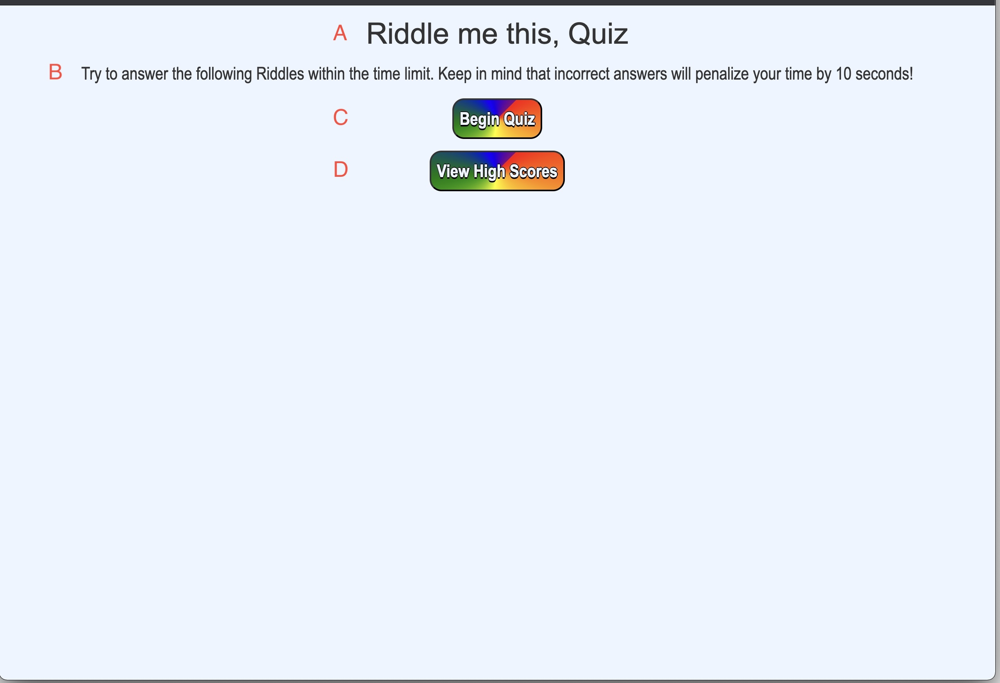
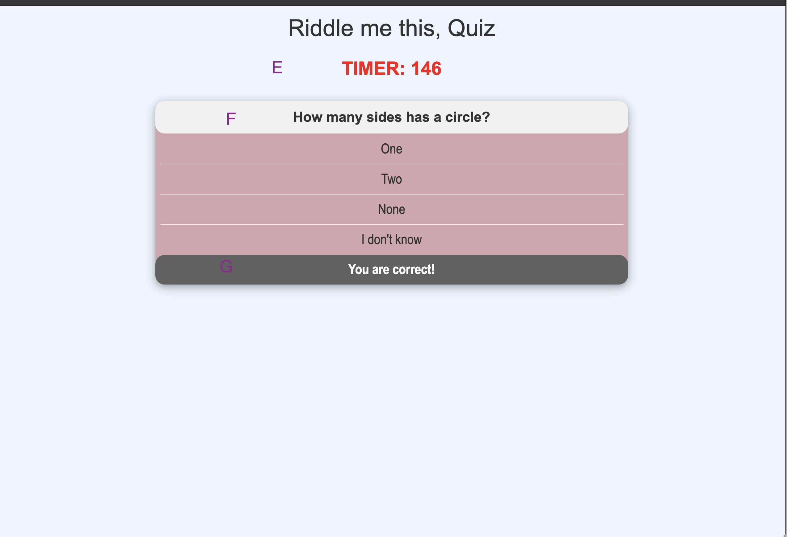
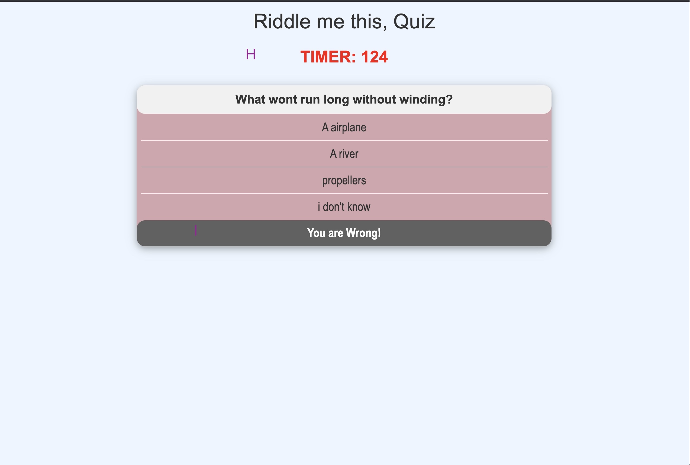
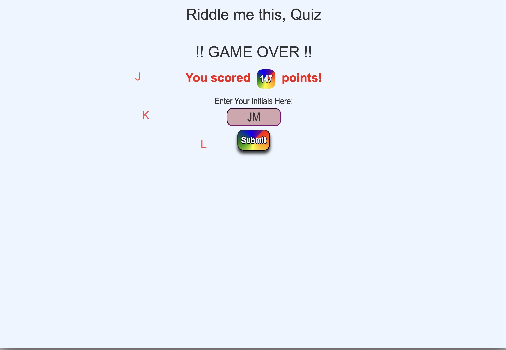
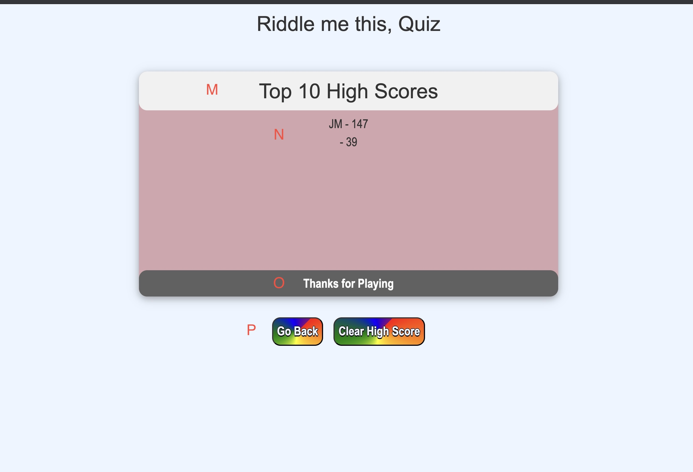

# myQuiz
# 04 Web APIs: Code Quiz

A. Title of the game. 

B. Rules of how the game will be played.

C. "Begin Quiz" button allows user to start playing when clicking on the button. 

D. "View HighScores" button allows user to see previous high scores stored in local storage.

E. Timer of the game. 

F. Questions are prompted for the user.

G. Game educates user that they made a correct choice.

H. User losses 10 seconds of time when making an incorrect choice.

I. Game educates user of their incorrect choice.

J. User is prompted with their scored points for the game. 

K. User can enter initials to save score.

L. "Submit" button allows user to save score into local storage and it will display on highscore screen.

M. At the end of the game the player is navigated to the high score screen where they can view all highscores saved in local storage. 

N. Top 10 high scores and initials displayed here.

O. Thanks for playing is prompted.

P. User has the abilities to "go back" and play and again. Or clear High Scores.

--------------------------------------------------------------------------------------------------------------------------

My Git hub profile : https://github.com/javiistacks

Git Hub repository: https://github.com/javiistacks/myQuiz

Finished Product: https://javiistacks.github.io/myQuiz/

